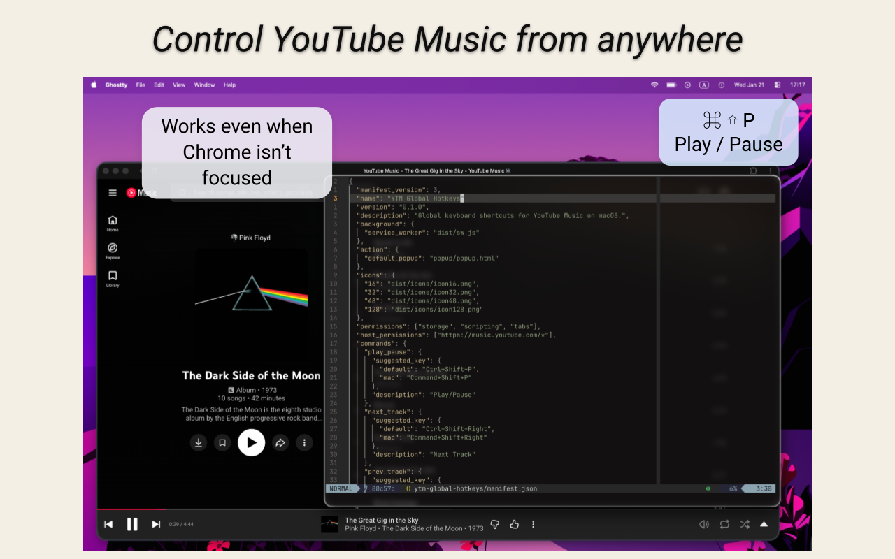
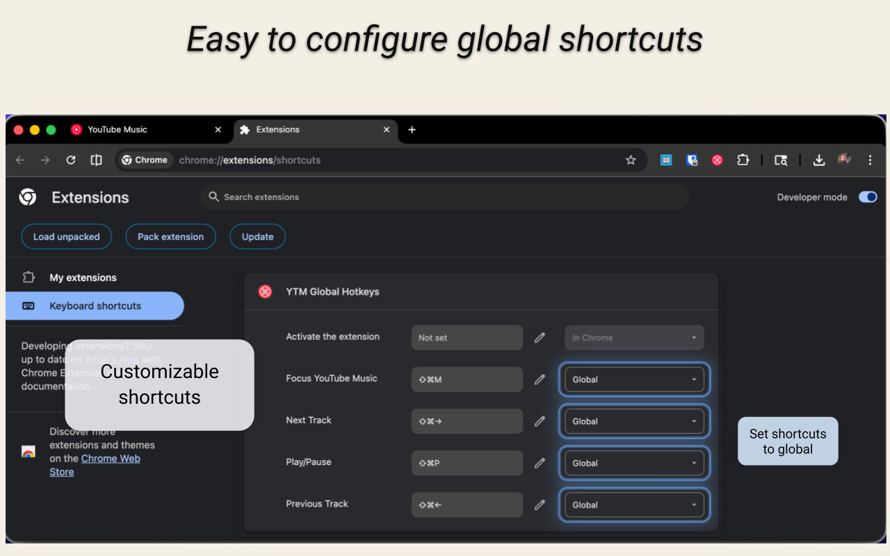

# &nbsp; YTM Global Hotkeys

Chrome Manifest V3 extension that provides global keyboard shortcuts for
YouTube Music using Chrome's `commands` API. It is optimized for macOS and
functionality may be degraded on other platforms. Chrome must be running.

  
  &nbsp;&nbsp;&nbsp;&nbsp;
  

## Commands

- `play_pause` — toggle play/pause on the current track (default: Cmd+Shift+P)
- `next_track` — skip to the next track in the queue (default: Cmd+Shift+Right)
- `prev_track` — go back to the previous track (default: Cmd+Shift+Left)
- `focus_ytm` — focus the most relevant YTM tab (or open one if missing) (default: Cmd+Shift+F)

## Setup

1. Run `npm run dev`.
2. Load the extension as unpacked in `chrome://extensions`.
3. Open `chrome://extensions/shortcuts`, assign shortcuts for each command, and
   set them to **Global** so they work even when Chrome is unfocused.

## Permissions

- `tabs` — locate existing YouTube Music tabs and focus the most relevant one.
- Chrome may show a "Read your browsing history" warning because of `tabs`,
  even though the extension only queries `music.youtube.com` tabs.
- `scripting` — inject the minimal play/pause/next/previous click handlers.
- `storage` — persist the last command, timestamp, and error for the popup.
- `https://music.youtube.com/*` — limit script injection to YouTube Music.

## Tab Selection Rules

Only one YouTube Music tab is controlled at a time. When a command runs, the
extension targets:

1. The active YTM tab, if present
2. Otherwise an audible YTM tab
3. Otherwise the most recently accessed YTM tab
4. If no YTM tab exists, it opens `https://music.youtube.com/` and targets it

## Development Notes

- Source is TypeScript in `src/`.
- Build output goes to `dist/` (complete loadable extension, not committed).
- Run `npm run build` to build, or `npm run dev` to watch for changes.
